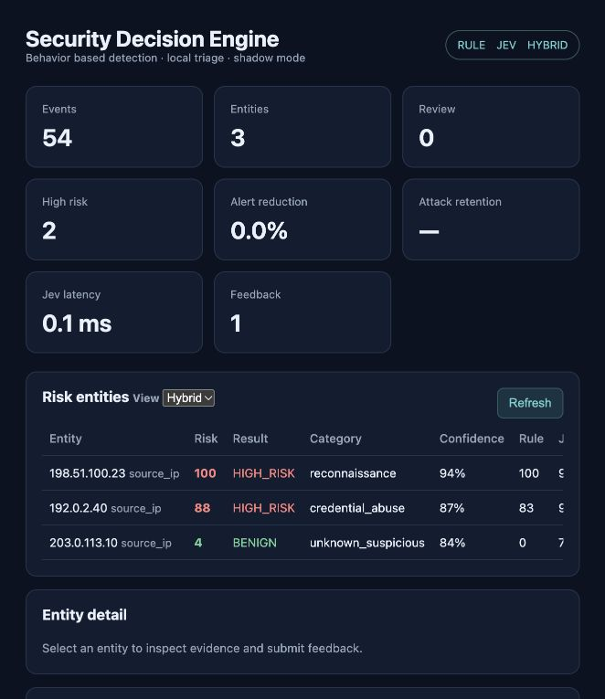

# JevSec — Security Decision Engine

**Self-hosted AI security decision engine for behavior-based web threat triage.** Local System-One inference, vendor-neutral provider interface, explainable evidence and shadow mode. It detects suspicious behavior that static rules may miss; it does not claim to prevent zero-days, replace a WAF, or guarantee unknown-attack detection.



This UI capture uses synthetic events and the explicit mock provider to illustrate the layout. Follow the [demo script](docs/launch/demo-script.md) to reproduce it.

## Quick start

完整安装、运行模式、配置、Docker、基准复现与故障诊断见[使用指南](docs/USAGE.md)。

Requirements: Python 3.12, `uv`, Git. The demo starts the separate [local-jev](https://github.com/amithgc/local-jev) service natively on Apple Silicon when needed, then imports safe synthetic Nginx traffic.

```sh
git clone <repository-url>
cd jevsec
./scripts/demo.sh
```

Open <http://127.0.0.1:8000>. First local-model launch downloads Qwen3-4B weights. This release supports one model identifier: `llm-qwen3-4b` (Qwen3-4B-Instruct-2507). Dashboard: change Rules/Jev/Hybrid view, inspect structured Attack Stories and evidence, then submit TP/FP/Unsure feedback stored locally.

For a deterministic UI-only smoke test without model service: `SDE_DECISION_PROVIDER=mock ./scripts/demo.sh` (not an ML result).

## Benchmark

The public benchmark uses fixed-seed, entity-disjoint synthetic data at 1%, 5%, and 10% malicious prevalence. It compares the deterministic project rules, Qwen3-4B, calibrated Qwen3-4B, Hybrid and prefilter→Qwen3. Thresholds are fitted from validation only. Full metrics, model revision, failure analysis, operating points and reproduction command: [v2 benchmark](reports/BENCHMARK_V2.md).

OWASP CRS 4.29.0 is also evaluated as a request-level mature WAF reference; methodology and limitations are in [the WAF comparison report](reports/WAF_COMPARISON.md). JevSec is behavioral triage in shadow mode and does not replace or bypass a WAF.

## Demo and shadow mode

```sh
./scripts/demo.sh
security-engine shadow --nginx /var/log/nginx/access.log
```

Shadow mode tails Nginx logs, handles truncation/replacement rotation and prints structured findings. It never blocks requests, changes network configuration or bans an address. Start with a copied or read-only log on a real system.

## How it works

Nginx/JSONL → privacy-aware normalization → IP/session/pseudonymous-user windows and historical baselines → explainable rules + local Jev → validation-fitted category thresholds → BENIGN / REVIEW / HIGH_RISK / UNCERTAIN → local SQLite and dashboard.

Cookies, Authorization values, passwords, API keys and unknown JSON keys are not retained. User and session identifiers are one-way pseudonymized. Jev receives whitelisted aggregate features, never raw request paths, user-agent strings or referer values. See [architecture](ARCHITECTURE.md), [privacy](PRIVACY.md), [security](SECURITY.md), and [threat model](THREAT_MODEL.md).

## Docker

On Linux, configure credentials and provider URL in a local `.env` (`cp .env.example .env` and replace the password), then `docker compose up --build`. The container runs the engine and keeps SQLite in a named volume; local-jev remains a separately hosted provider. Docker Desktop on macOS does not provide the host Apple GPU/MPS to the Linux container. Use native local-jev on M5.

## Limitations

- v0.2 benchmark and demo scenarios are synthetic; the benchmark is not a production prevalence estimate.
- This is security triage, not a WAF replacement or a guarantee against unknown vulnerabilities.
- Dashboard feedback is local and recorded for later calibration review; it does not silently change thresholds.
- Basic authentication is required on non-loopback binds; use TLS at a trusted reverse proxy. Loopback-only development can run without authentication.
- Source IP remains identifying data in SQLite. Configure filesystem access, retention and backups for your environment.

See [release notes](CHANGELOG.md), [failure analysis](reports/FAILURE_ANALYSIS.md), and [contribution guide](CONTRIBUTING.md).

## CLI

```sh
.venv/bin/security-engine doctor
.venv/bin/security-engine serve
.venv/bin/security-engine ingest /var/log/nginx/access.log --format nginx --follow
.venv/bin/security-engine ingest sample.jsonl --format jsonl
.venv/bin/security-engine generate-dataset
.venv/bin/security-engine benchmark --provider local_jev --model llm-qwen3-4b
```

The supported Nginx format is Combined Log Format with optional trailing request time. JSONL is whitelisted into the shared event schema; unknown fields such as cookies, passwords, Authorization, API keys and secrets are discarded. Provide a pre-hashed pseudonymous `session_hash` if session grouping is needed.

## Detection and evaluation

Events are grouped by source IP and, when provided, session hash into 1-minute and 5-minute windows. The deterministic baseline has named rules and evidence. Jev receives only structured aggregate features; raw paths, user-agent strings and referers are not sent. Hybrid scoring retains an uncertainty state for low confidence or rule/model disagreement. It is triage output, not a block decision.

Generate a fixed-seed dataset (10,000+ events), then run a held-out evaluation:

```sh
.venv/bin/security-engine generate-dataset --out datasets/generated --entities 1200 --seed 20261001
.venv/bin/security-engine benchmark --data datasets/generated --reports reports --provider local_jev --model llm-qwen3-4b --sample-limit 120
```

The legacy CLI benchmark samples up to the requested number from the test partition. The public benchmark evaluates every held-out behavior window. Thresholds are selected on validation only. Never interpret synthetic metrics as production effectiveness.

## Configuration

Environment variables: `SDE_DATABASE`, `SDE_DECISION_PROVIDER` (`mock` or `local_jev`), `LOCAL_JEV_BASE_URL`, `LOCAL_JEV_MODEL` (fixed to `llm-qwen3-4b`), `SDE_DECISION_TIMEOUT`, `SDE_MODE` (`hybrid`, `rules_only`, `jev_only`), `SDE_ALERT_THRESHOLD`, `SDE_HIGH_RISK_THRESHOLD`, `SDE_LOW_CONFIDENCE_THRESHOLD`.

## Deployment

- macOS Apple Silicon: `scripts/install_macos.sh`, then start local-jev and run the engine natively.
- Linux: `docker compose up --build`; the engine connects to a separately hosted local-jev URL via `LOCAL_JEV_BASE_URL`. Docker on macOS is not assumed to provide Apple GPU acceleration.

## Safety and privacy

No automated enforcement. No external target activity is performed. See [SECURITY.md](SECURITY.md), [PRIVACY.md](PRIVACY.md), and [THREAT_MODEL.md](THREAT_MODEL.md). Events and assessments are local SQLite records; configure retention and file-system access for your environment.

## Project state

This is v0.2.0 and an engineering prototype. Authentication is HTTP Basic for non-loopback deployment; multi-tenant access control and enterprise retention controls remain out of scope. Current corrected Qwen3 and OWASP CRS comparison results are in [reports/BENCHMARK_V2.md](reports/BENCHMARK_V2.md) and [reports/WAF_COMPARISON.md](reports/WAF_COMPARISON.md). Release steps are in [RELEASE_COMMANDS.md](RELEASE_COMMANDS.md).
